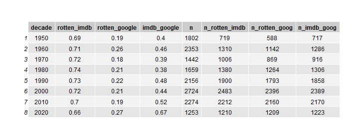

## Mixed Signals: Movie Quality Assessments Across Platforms

Is the difference between ratings across different platforms for *Guardians of Galaxy* the norm? And are the differences in ratings systematic, or are the ratings largely unrelated?

## Data from 1950--2020

To shed light on the question, we scraped the list of American films on Wikipedia produced between 1950 and 2020. (See [here](https://en.wikipedia.org/wiki/List_of_American_films_of_2019), for example.)  We then scraped the Google Knowledge Panel using APIfy for each of the movies. (The scripts for scraping the data are posted [here](https://github.com/NoahFinberg/google_kg_movie_scraper).)

## Analyses

In all, we have 16,319 movies and movie ratings from 19 platforms. For seven platforms, however, we have less than 100 movie reviews. We subset our initial analysis on 48,613 (average) ratings from the 12 platforms for which we have ratings for 100 or more movies. 

We estimate the correlation between the average platform ratings. (See below for the (Pearson's) correlation matrix.) The median correlation between average ratings of two platforms was .37. (The median Spearman's correlation was .35.)

### Movie Ratings Over Time

To see how movies have been rated over time, we plotted the average of a movie-quality index over time (see below). To build an index of movie quality, we rescaled the ratings from the three platforms for which we have the most data---IMDB, Rotten Tomatoes, and Google---to lie between 0 and 1 and averaged it. The figure shows that movie quality steadily declined between 1950 and 2000. And since then, there has been a modest uptick.

But if you separate the platform ratings, you get three different trend lines. Google ratings are largely flat over time, with a modest decline since 2010. Rotten tomatoes ratings follow a very different trend with a sharp decline between 1950 and 2000 and a sharp uptick since 2000.  IMDB ratings follow yet another trend---they decline till the 1980s and gently slope upward after that. 

### Correlation Between Aggregate Movie Ratings By Time, Maturity Ratings, Genre

The differing over-time trend lines across platforms are disconcerting.  But to further understand the issue, we plot correlations across platform ratings by decade (see below). The correlation between Rotten Tomatoes Ratings and IMDB ratings is relatively similar across time. But the other two trends in correlations are much more volatile. The correlation between Rotten Tomatoes and Google changes sizably, from .09 in the 1950s to .36 in the 1960s. The correlation between IMDB and Google ratings swings even more, from .22 in the 1950s to .65 in the 2020s. Overall, it seems the correlation between IMDB and Google ratings becomes stronger over time.

If we check correlation across platforms by maturity ratings, we see some variation between Rotten Tomatoes and Google, but overall it doesn't seem that maturity rating have much explanatory power. 

Next, we investigate how the correlation between ratings across platforms varies by genre. We limit ourselves to the top 10 most popular genres. We see fairly sizably variation in the correlation between IMDB and Google, with the correlation varying between .29 and .71. The range of correlations between Rotten Tomatoes and Google is also very wide---.04 to .48. 
 

### Top 100

I estimated the correlation between ratings for [movies that earned the most (unadjusted for inflation) on the domestic box office](https://www.filmsite.org/boxoffice.html). (Presumably variation in ratings for top 100 is smaller than if we had the entire sample. And that means the correlation is estimated over a small range. It is also likely that lots of people rated these movies so the measures are likely precise.)

The correlation between metacritic and rotten tomatoes is just .48. The correlation between imdb and google ratings is just .33. The highest correlation is surprisingly between rotten tomatoes and imdb ratings. 

|             | imdb | rotten | metacritic | google |
|-------------|------|--------|------------|--------|
| imdb        | 1.00 | 0.74   | 0.36       | 0.33   |
| rotten      | 0.74 | 1.00   | 0.48       | 0.23   |
| metacritic  | 0.36 | 0.48   | 1.00       | 0.18   |
| google      | 0.33 | 0.23   | 0.18       | 1.00   |

### License

Released under [CC BY 2.0](https://creativecommons.org/licenses/by/2.0/).
