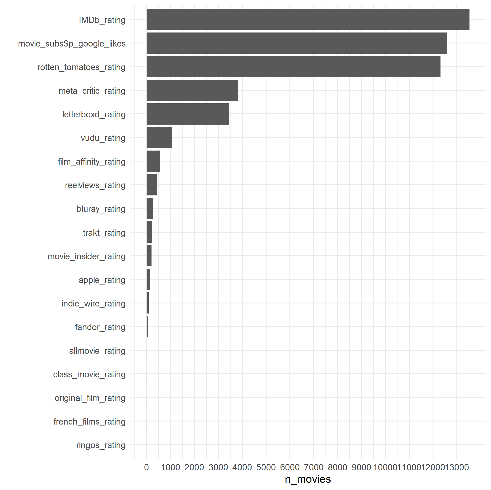
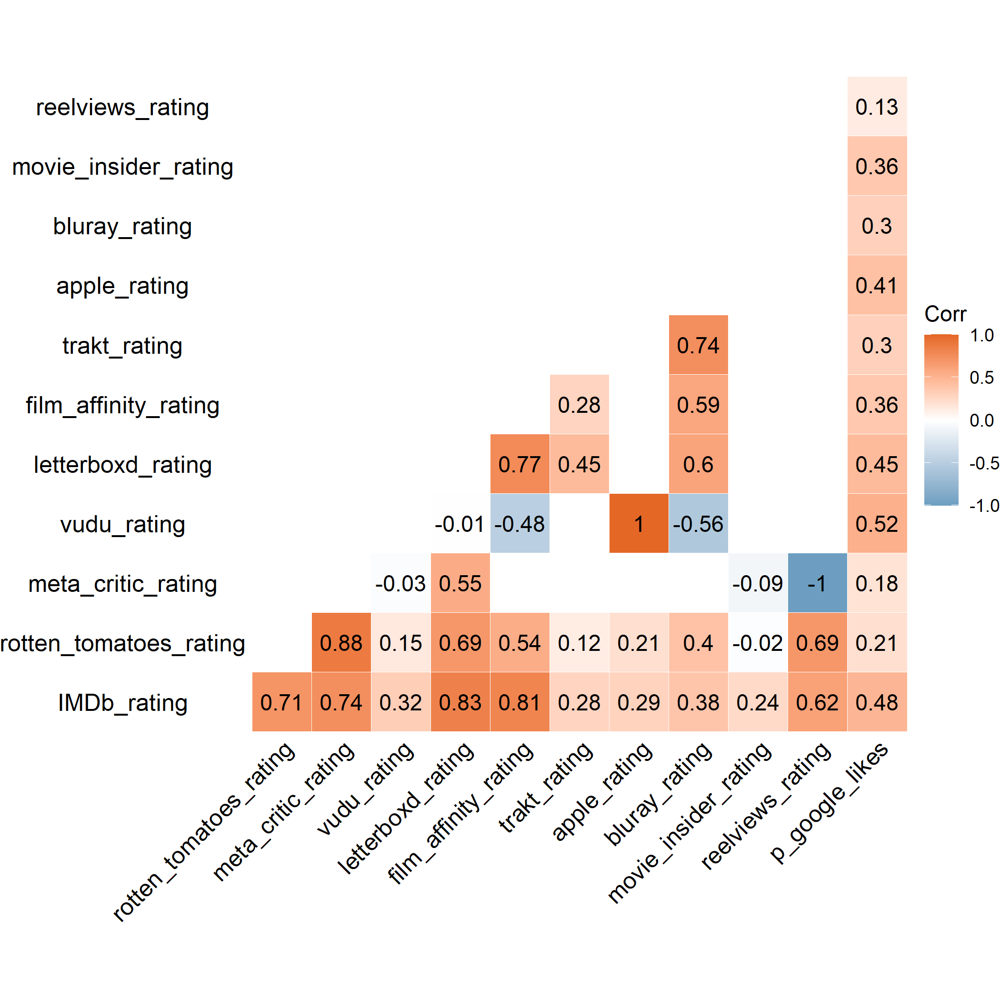

## Mixed Signals: Movie Quality Assessments Across Platforms

Is the difference between ratings across different platforms for *Guardians of Galaxy* the norm? 

## Data from 1950--2020

We scraped the list of American films on Wikipedia produced between 1950 and 2020. (See [here](https://en.wikipedia.org/wiki/List_of_American_films_of_2019), for example.) We then scraped the Google Knowledge Panel using APIfy for each of the movies. The scripts and data are posted [here](https://github.com/NoahFinberg/google_kg_movie_scraper).

## Analyses

In all, we have 16,319 movies and movie ratings from 19 platforms. For 7 platforms, however, we have less than 100 movie reviews. 

We subset our initial analysis on 48,613 (average) ratings from the 12 platforms for which we have ratings for 100 or more movies. We estimate the correlation between the average platform ratings. (See below for the (Pearson's) correlation matrix.) The median correlation between average ratings of two platforms was .37. (The median Spearman's correlation was .35.)

### Movie Ratings Over Time?

### Top 100

I estimated the correlation between ratings for [movies that earned the most (unadjusted for inflation) on the domestic box office](https://www.filmsite.org/boxoffice.html). (Presumably variation in ratings for top 100 is smaller than if we had the entire sample. And that means the correlation is estimated over a small range. It is also likely that lots of people rated these movies so the measures are likely precise.)

The correlation between metacritic and rotten tomatoes is just .48. The correlation between imdb and google ratings is just .33. The highest correlation is surprisingly between rotten tomatoes and imdb ratings. 

|             | imdb | rotten | metacritic | google |
|-------------|------|--------|------------|--------|
| imdb        | 1.00 | 0.74   | 0.36       | 0.33   |
| rotten      | 0.74 | 1.00   | 0.48       | 0.23   |
| metacritic  | 0.36 | 0.48   | 1.00       | 0.18   |
| google      | 0.33 | 0.23   | 0.18       | 1.00   |

### License

Released under [CC BY 2.0](https://creativecommons.org/licenses/by/2.0/).
